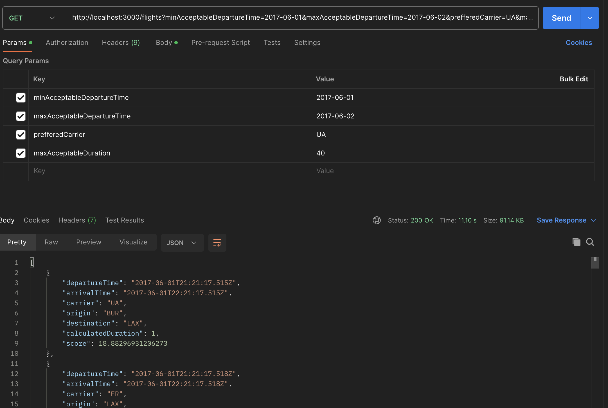

# Backend Engineering Test

- Completed all the requirements for the fetching the flights based on score in acending order and also used haversine to calculate distance

## Improvements

- User authentication and authorization
- Implement proper caching layer like redis
- utilize DBMS for avoiding in memory and storage expensive solutions
- Implement rate limiting
- Parallelize independent async operations
- Implement automation testing
- Use Typescript

## Preview

